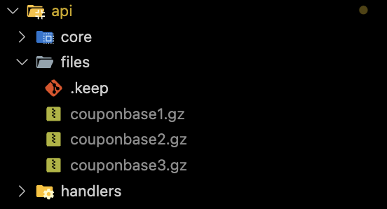
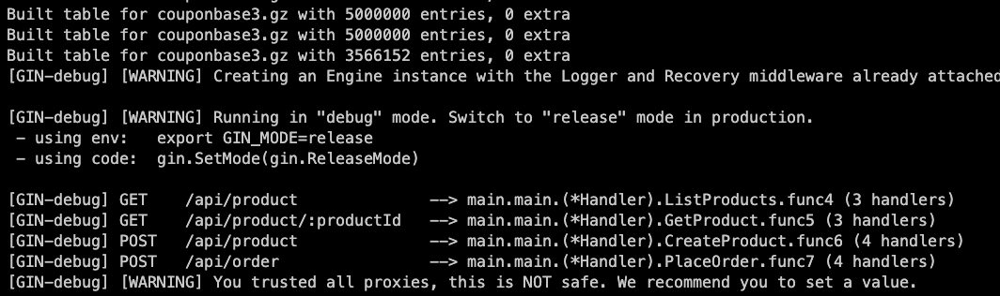
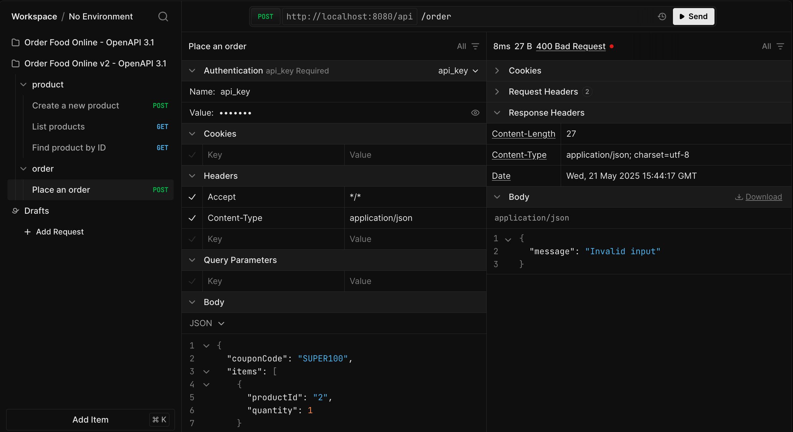
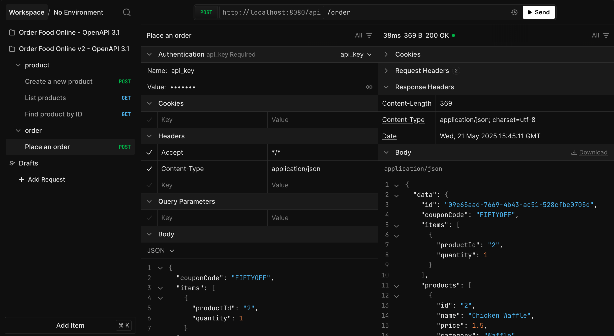

## Getting Started

Place couponbase1.gz, couponbase2.gz, couponbase3.gz at:
api/files/


After start, server will load file to cache for coupon check


After cache, can check coupon when create order




Compare RAM on cache types

| Cache Type    | RAM Usage (MB) | Extra                                      |
| ------------- | -------------- | ------------------------------------------ |
| ConcurrentMap | 6030.48        |                                            |
| MPH           | 4850.74        | with <=10 chars length code, perfect index |
| Shard Slice   | 2390.66        | with <=10 chars length code                |
| BloomFilter   | 896.80         | 0.001% (failed positive rate)              |
| Bitmap        | 965.04         | collition rate                             |

Note: With uint64 only encode 10 chars 0-9,A-Z

- 10 chars \_ 6 bits = 60 bits total → fits into 64 bits with 4 bits unused
- 11 chars \_ 6 bits = 66 bits > 64 bits → cannot fit without collisions

### With docker

#### Run dev with watch files and auto restart

```sh
make dev
```

#### Run production

```sh
make run
```

### Without docker

Edit config.ini (dev)

```ini
[Database]
User = root
Password = secret
Host = localhost
Port = 3306
Name = orderdb
```

Run

```sh
go get
air
```

Or

```sh
go run main.go
```
