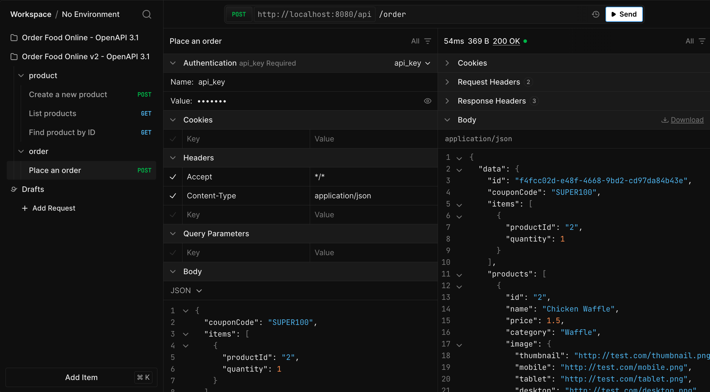

## Getting Started
Place couponbase1.gz, couponbase2.gz, couponbase3.gz at:
api/files/


After start, server will load file to cache for coupon check


After cache, can check coupon when create order


Compare RAM on cache types
ConcurrentMap 17313.89 MB
MPH 11238.68 MB## RAM Usage Comparison

| Cache Type      | RAM Usage (MB) |
|-----------------|----------------|
| ConcurrentMap   | 17,313.89      |
| MPH             | 11,238.68      |

### With docker
#### Run dev with watch files and auto restart
```sh
make dev
```

#### Run production
```sh
make run
```

### Without docker
Edit config.ini (dev)
```ini
[Database]
User = root
Password = secret
Host = localhost
Port = 3306
Name = orderdb
```

Run
```sh
go get
air
```

Or
```sh
go run main.go
```