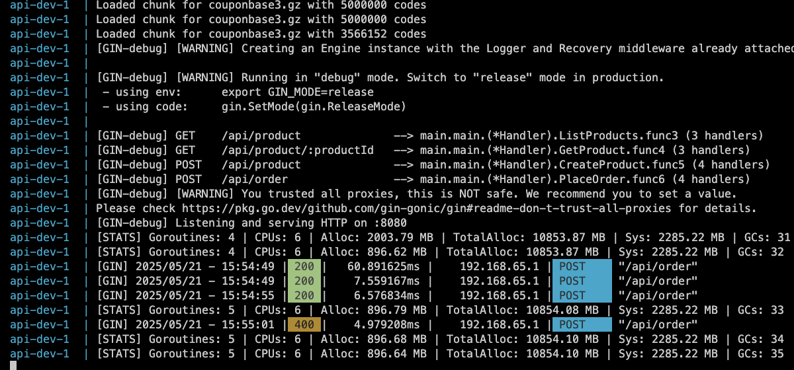

## Getting Started
Place couponbase1.gz, couponbase2.gz, couponbase3.gz at:
api/files/


After start, server will load file to cache for coupon check


After cache, can check coupon when create order




Compare RAM on cache types

| Cache Type      | RAM Usage (MB) | Extra |
|-----------------|----------------|-------|
| ConcurrentMap   | 17,313.89      |       |
| MPH             | 4852.04        | with <=10 chars length code   |
| BloomFilter     | 896.80         | 0.001% (failed positive rate) |
| Bitmap          | 965.04         | collition rate |

### With docker
#### Run dev with watch files and auto restart
```sh
make dev
```

#### Run production
```sh
make run
```

### Without docker
Edit config.ini (dev)
```ini
[Database]
User = root
Password = secret
Host = localhost
Port = 3306
Name = orderdb
```

Run
```sh
go get
air
```

Or
```sh
go run main.go
```